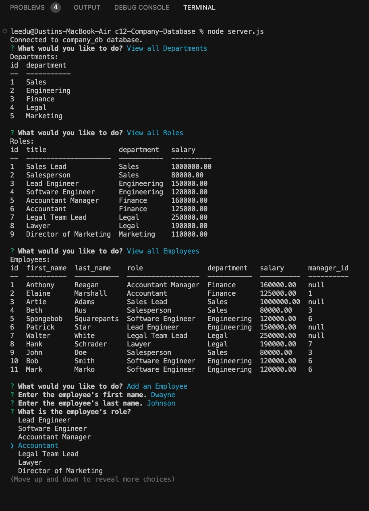

# Company Database - MySQL
[](https://opensource.org/licenses/MIT)

A command-line application built with the [inquirer](https://www.npmjs.com/package/inquirer) library to collect user input. The application allows the user to view departments, roles, and employees within the company. The user is also able to add new departments, roles and employees. Another function is to be able to update existing employee's roles. By viewing the employee table, the user is able to see the name, salary, role, department, and manager ID. 

Here you will find a [video](https://drive.google.com/file/d/1vDrABSHu1-SHmLhCVnHF_EzSxbSw60pE/view) demonstrating the functionality of the app.

## Installation
The dependencies needed for this application are [mysql2](https://www.npmjs.com/package/mysql2), [inquirer](https://www.npmjs.com/package/inquirer), the [console.table](https://www.npmjs.com/package/console.table) to create the tables in the CLA and the [dotenv](https://www.npmjs.com/package/dotenv) package to load environment variables from a separate .env file.

To install the dependencies, run:  
```
npm i
```

## Usage
To invoke the app navigate to the corresponding directory then run:
```
node server.js
```
A menu with options will populate the command-line when the app is called. Follow instructions to view, add or update company department, roles or employees.




## License
This application is licensed under the [MIT License](https://opensource.org/licenses/MIT).